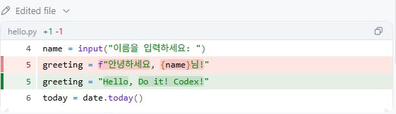

# [Do it! 실습] diff로 변경 내용을 비교하고 검토하기

diff는 파일의 수정 전후 차이를 보여 주는 화면입니다. 인사말 한 줄을 바꾸고 요청한 부분만 바뀌었는지 확인합니다.

1. 앞 실습의 `hello.py`를 사용합니다. 이 실습부터 시작한다면 [시작 파일](start/hello.py)을 별도 작업 폴더에 복사해 엽니다.
2. Codex에 다음 문장을 입력합니다.

```text
hello.py의 인사말을 "Hello, Do it! Codex!"로 바꿔 줘.
다른 파일은 수정하지 마.
```

3. 응답에 나타난 `Edited file`의 `hello.py` 변경 내용을 펼쳐 봅니다. 작업 결과 아래에 **Review** 버튼이 표시되면 클릭해 **Codex Diff** 탭을 엽니다. 자동으로 비교 화면이 열려 있다면 바로 확인합니다. 아래 이미지는 VS Code에서 직접 캡처한 변경 내용 영역입니다.



4. 빨간 줄은 삭제된 내용, 초록 줄은 추가된 내용입니다. `hello.py`만 바뀌었고 인사말 한 줄이 아래처럼 바뀌었는지 확인합니다.

```diff
-greeting = f"안녕하세요, {name}님!"
+greeting = "Hello, Do it! Codex!"
```

5. 파일 편집이 허용된 환경에서는 수정이 이미 파일에 저장되어 있을 수 있습니다. **Review는 diff를 여는 버튼이며, 수정 적용을 승인하는 버튼으로 설명하지 않습니다.** 일반적인 `Approve`, `Accept`, `Apply` 버튼을 찾을 필요는 없습니다. 실제 권한 승인 요청이 나타나면 그 요청의 대상과 범위를 읽습니다.
6. 터미널에서 `python hello.py`를 실행하고 이름을 입력합니다. 이제 이름과 관계없이 `Hello, Do it! Codex!`와 오늘 날짜가 출력되어야 합니다. 이름 입력 코드는 이번 요청에서 삭제하지 않았기 때문에 입력 안내는 남아 있습니다.
7. 다른 코드도 바뀌었다면 다음처럼 구체적으로 요청합니다.

```text
이번에 바꾼 인사말 한 줄만 유지하고, 이번 작업에서 함께 바꾼 나머지 부분은 수정 전으로 돌려 줘.
이전부터 있던 내 수정은 유지해 줘. 변경 파일과 차이를 다시 보여 줘.
```

## 수정 전에 먼저 검토하고 싶다면

첫 요청을 다음처럼 바꿉니다. 아래 문장은 위 실습과 다른 진행 방법입니다.

```text
hello.py의 인사말을 "Hello, Do it! Codex!"로 바꾸려 해.
아직 파일을 수정하거나 명령을 실행하지 말고, 바꿀 한 줄을 diff 형식으로만 보여 줘.
내가 적용하라고 말하면 그때 hello.py만 수정해 줘.
```

제안한 차이를 확인한 뒤 `확인했어. 제안한 한 줄 변경을 hello.py에 적용해 줘.`라고 이어서 요청합니다.

`Full file content failed to load`가 보이면 **Retry**로 다시 불러옵니다. 계속 실패하면 변경 내용이 보이는 대화 영역과 실제 파일을 확인하거나 VS Code에서 시작 파일을 **비교를 위해 선택**한 뒤 수정 파일을 **선택한 항목과 비교**합니다.

[모범 코드](../../solutions/ch02/05_diff/hello.py) · [예상 diff](../../solutions/ch02/05_diff/expected.diff) · [공식 권한 안내](https://learn.chatgpt.com/docs/agent-approvals-security)
