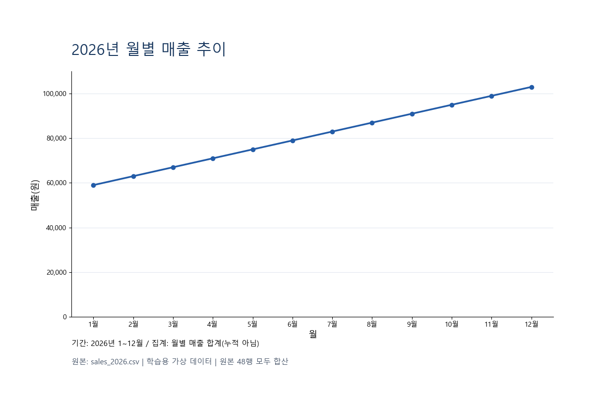

# 모범 답안: PNG 그래프 3장

[월별 선 그래프](chart_01.png) · [카테고리 도넛](chart_02.png) · [지역별 가로 막대](chart_03.png)

모든 PNG는 1200×800 픽셀입니다. 도넛에는 축이 없으므로 원 단위 금액·비율·분모를 표시했습니다. 연 매출 972,000원, 도서 486,000원, 광주 288,000원을 원본과 비교하세요.



## 직접 다시 실행하기

1. [make_charts.py](make_charts.py), [requirements.txt](requirements.txt)를 `sales_2026.csv`가 있는 연습 폴더에 복사합니다.
2. Python 3가 설치된 환경의 터미널에서 아래 명령을 순서대로 실행합니다. 패키지 설치 때만 인터넷 연결이 필요합니다.

```powershell
python -m pip install -r requirements.txt
python make_charts.py sales_2026.csv --output my_charts
```

3. `my_charts`에 만들어진 PNG 3장을 엽니다. 기존 PNG는 덮어쓰지 않습니다. 다른 운영체제에서는 `--font` 뒤에 설치된 한글 TTF 파일 경로를 지정하세요.

[실습으로 돌아가기](../../../../chapter05/04_png_charts/README.md)
